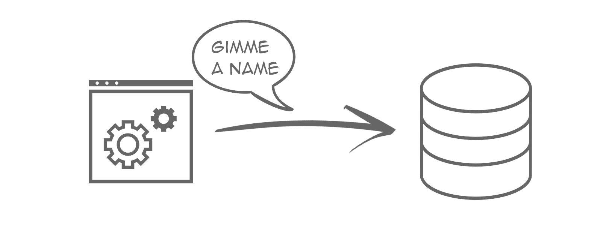

# your connection deserves a name

## Missing a system or a programing language?

If you

* know a system that supports connection naming, and it is not listed here
* miss a programing language example in your favorite language

let us know in either of two ways:

1. Create an Issue with all the details you have in mind
2. or create a Pull Request with the implementation.

We are happy to extend this project.

## TODO

- [ ] Write the blog post
- [ ] Link the blog post (README, Homepage)
- [ ] Add a logo (incl. Social Preview Image)
- [ ] Add a repository description
- [ ] Add a proper README
- [ ] Add pictures to the systems