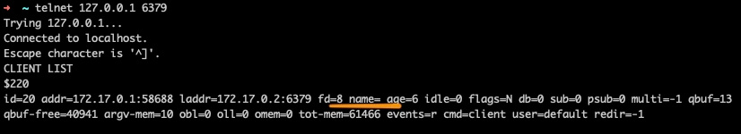
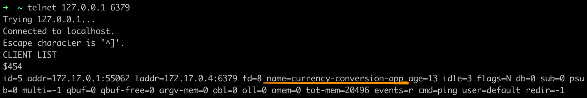

# your _redis_ connection deserves a name

Examples on how to assign a particular name to a [redis](https://redis.io/) connection.

Programmming languages:

- [Go](./go)
- [PHP](./php)

## How it works

After creating a connection to redis, send the [*CLIENT SETNAME*](https://redis.io/commands/client-setname "CLIENT SETNAME @ redis docs") command:

`CLIENT SETNAME currency-conversion-app`

Via [`CLIENT LIST`](https://redis.io/commands/client-list "CLIENT LIST @ redis docs") you can see all clients, including their name:

```
$ CLIENT LIST
id=3 addr=172.17.0.1:61516 name=currency-conversion-app [...]
```

## How it looks like

### Before



## After



## Don't know what this is all about?

Read the original blog post [_your connection deserves a name @ andygrunwald.com_](https://andygrunwald.com/blog/your-connection-deserves-a-name/ "Article your connection deserves a name at Andy Grunwalds blog").

Additionally, you can check out the [projects README](https://github.com/andygrunwald/your-connection-deserves-a-name#readme).